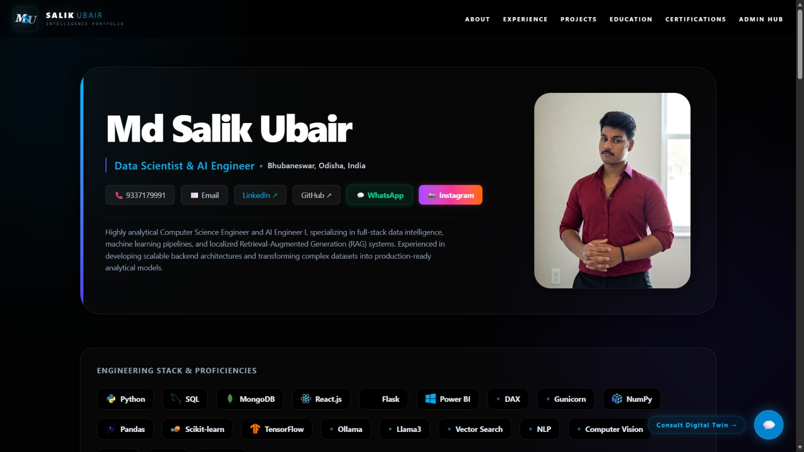
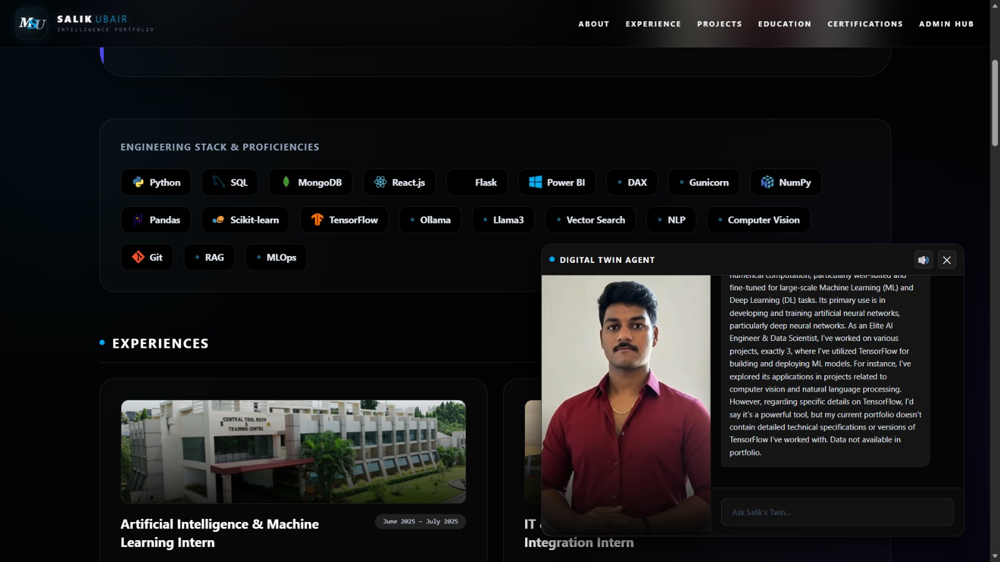
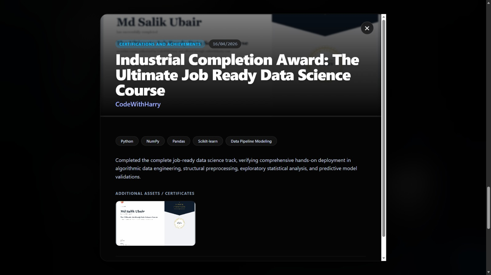
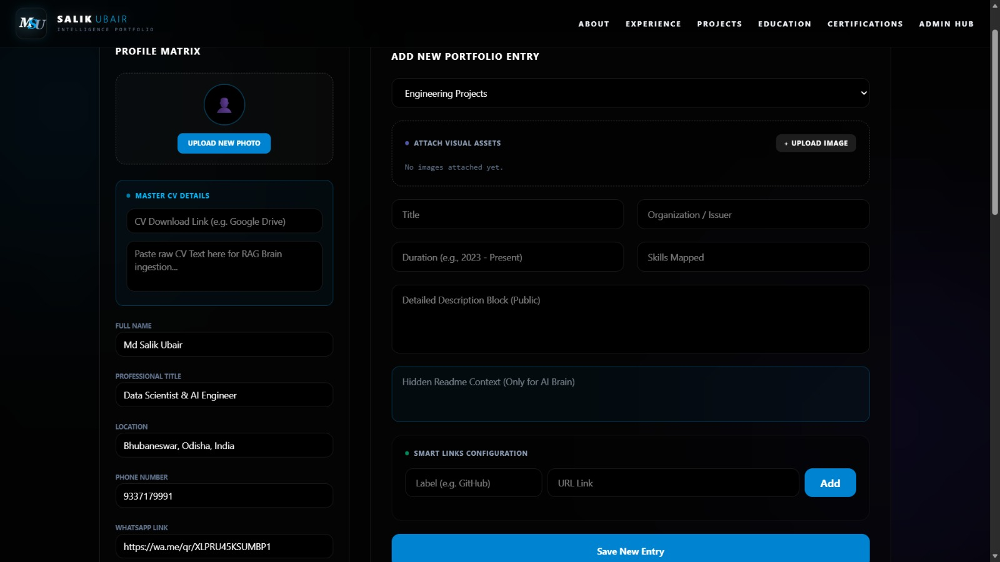
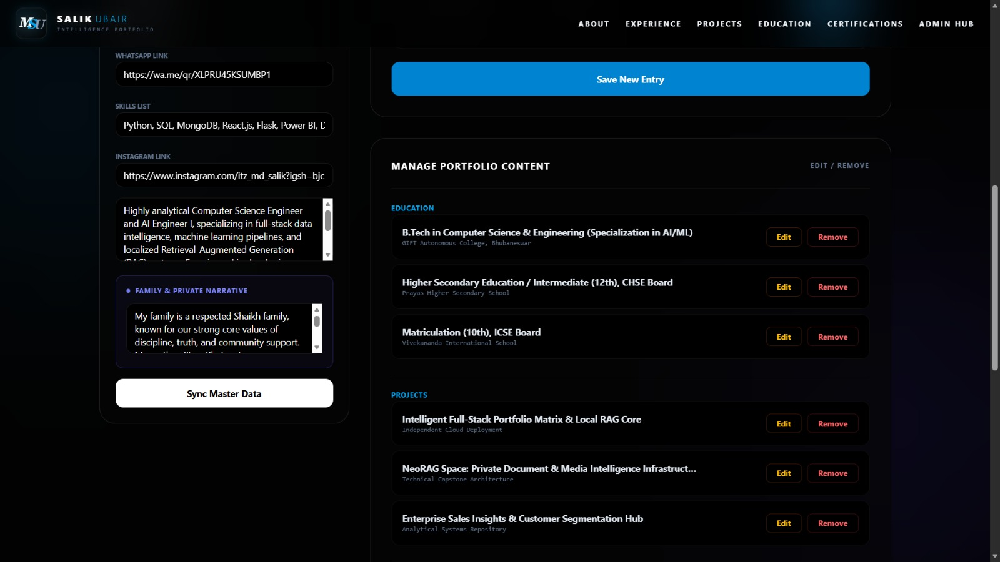
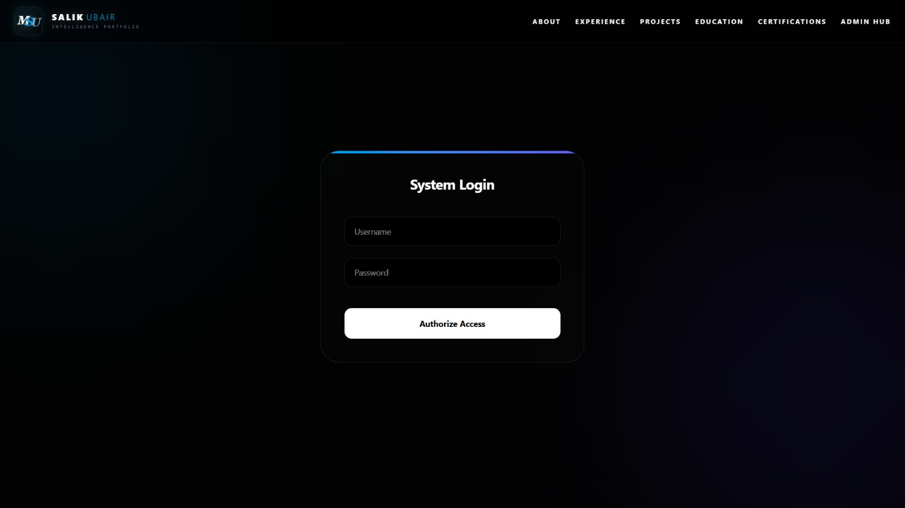

<div align="center">
  
</div>

<h1 align="center">Production-Grade Virtual Presence & Real-Time RAG Context Engine</h1>

<p align="center">
  A highly advanced, production-ready web portfolio featuring a <b>localized Retrieval-Augmented Generation (RAG) Digital Twin</b>. Engineered to decouple heavy asynchronous AI orchestration from the client interface, providing seamless, real-time interactive intelligence backed by an editable database architecture.
</p>

---

## 🚀 Architectural Innovations & Core Features

### 1. The Digital Twin (Real-Time AI Agent)
<div align="center">
  
</div>

*   **Inference Engine:** Utilizes `Llama-3 (70B)` via Groq API for ultra-low latency, intelligent response synthesis.
*   **Semantic Matrix:** Localized `ChromaDB` vector store powered by Google Generative AI Embeddings (`text-embedding-004`).
*   **Synchronized Audio-Visuals:** Integrates `Edge-TTS` for real-time audio streaming. Features a hardware-accelerated video state controller that dynamically transitions a virtual avatar between idle, thinking, and speaking modes in absolute lockstep with the text-to-speech rendering.
*   **Audio State Lock:** Bypasses consecutive query overlapping via aggressive Audio object source flushing and precise execution tracking.

### 2. Cinematic Node Exploration
<div align="center">
  
</div>

*   Immersive, deep-dive modal views for individual database nodes (Projects, Experiences, Education).
*   Engineered with window history state listeners (popstate event routing) to seamlessly trap and handle manual mobile back-navigation, securely closing viewport modals rather than crashing the global application runtime context.
*   Automated client-side utility that dynamically maps and pulls official developer technology logos from the Devicon CDN based on database array strings.

### 3. Dynamic Admin Control Hub & Self-Healing Data
<div align="center">
  
  
</div>

*   **Zero-Downtime Reconstructions:** A secure, authenticated dashboard linked to a persistent `MongoDB` layer. Enables the native manipulation of portfolio nodes to instantly purge and reconstruct the local semantic vector store on the fly without system downtime.
*   **Asset Management:** Integrated workflows for seamless display picture and project thumbnail updates.

<div align="center">
  
</div>

---

## ⚙️ Core Technology Stack

**Frontend Interface Layer:**
*   React.js
*   Tailwind CSS v4
*   Hardware-Accelerated Video Elements
*   Devicon CDN Dynamic Mapping

**Backend Execution Core:**
*   Python (Flask)
*   Gunicorn (WSGI Gateway for multi-threaded error mitigation)
*   ChromaDB (Vector Similarity Search)
*   MongoDB (Persistent Storage & Structural Data)
*   Groq API (Llama3) & Google Gemini API (Embeddings)

---

## 🛠️ Local Deployment Architecture

### Prerequisites
*   Node.js (v16+)
*   Python 3.9+
*   MongoDB Instance (Local or Cloud Atlas)

### 1. Backend Initialization
```bash
cd backend
python -m venv venv
source venv/bin/activate  # On Windows: venv\Scripts\activate
pip install -r requirements.txt
```
## Establish the environment variables by creating a .env file in the backend root:
MONGO_URI=your_mongodb_connection_string
GEMINI_API_KEY=your_google_api_key
GROQ_API_KEY=your_groq_api_key
JWT_SECRET=your_secure_cryptographic_secret
ADMIN_USERNAME=admin
ADMIN_PASSWORD=your_secure_password
# Execute the Server:
python run.py
# 2. Frontend Initialization
cd frontend
npm install
# Configure the API routing by creating a .env file in the frontend root:
VITE_API_URL=[http://127.0.0.1:5000]

# Deploy the Development Server:
npm run dev

---
<div align="center">
  <p>Architected and Engineered by <b>Md Salik Ubair</b></p>
  <p>AI Engineer I & Data Scientist | 📍 Bhubaneswar, India</p>
  <p>
    <a href="mailto:mdsalikubair@gmail.com">Email</a> • 
    <a href="https://linkedin.com/in/md-salik-ubair">LinkedIn</a> • 
    <a href="https://portfolio-salik-live.vercel.app">Live Portfolio</a>
  </p>
</div>